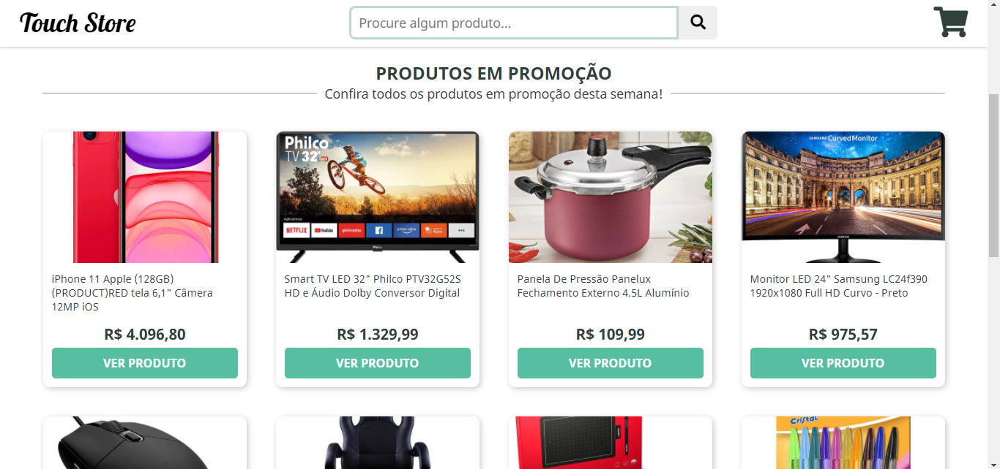

  

🛍️ A beautiful example of e-commerce 💜

<h1 align="center">Touch Store</h1>

## Project Status :construction:
- Touch Store | Project complete :white_check_mark:

## Demonstration

- <a href="https://luisspassos.github.io/TouchStore-Store/">https://luisspassos.github.io/TouchStore-Store/</a>

## Technologies used :scroll:
- <a href="https://developer.mozilla.org/pt-BR/docs/Web/HTML">HTML</a>
- <a href="https://developer.mozilla.org/pt-BR/docs/Web/CSS">CSS</a>
- <a href="https://developer.mozilla.org/pt-BR/docs/Web/JavaScript">JavaScript</a>

## License :white_check_mark:

- MIT License, <a href="./LICENSE">read more</a>.

luisspassos &copy; 2021.

